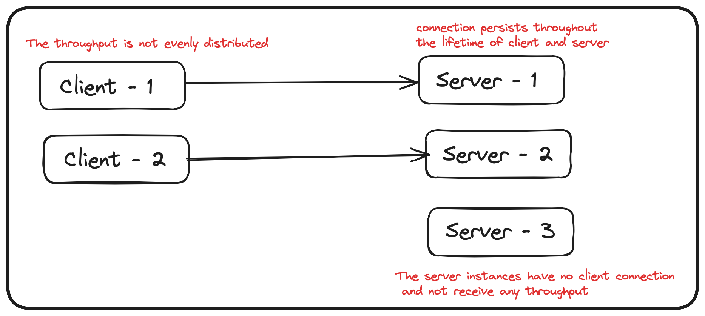

# GRPC Connection pool - A golang implementation for grpc connection pooling
This library directly addresses the problem I faced with GRPC due to the nature of it's connection
and the custom solution we have built to address the same for our application working at a tremendously high scale in production.

```
This library is inspired from the custom solution we have built in our organisation to address the same problem.
This is a very common GRPC level problem which might every GRPC user might be facing, idea is to share the solution with everyone 
since not much is available in the community otherwise around the same.
```

## What is this library about?

This is a custom implementation of a grpc connection pooling which manages and honours
a managed pool of connection between client and server to serve the incoming RPC requests.

## Why is this needed?

In a traditional grpc usage, a connection is established between a **client** and a **server**.
This persistent sticky connection lives through the entire lifetime of the client and server
and all the RPCs are served over the existing connection underlying the power of [multiplexing]().

[//]: # (![GRPC connection]&#40;doc/grpc_connection.png&#41;)

This does not seem to be of any concern unless you zoom out and look over the potential problem that may arise in
production at scale.
The problem with native way of using grpc connection is explained in the blog [here](TODO write medium article ARPIT).




## What this library provides?

This library is a custom implementation of a grpc connection pooling to overcome the problems that arise due to a sticky
grpc single connection usage.

## Quickstart

```
go get -u github.com/arpit006/go-grpc-conn-pool
```

## High level Library features

It mimics most of the features of a connection pooling which is not offered in a
traditional `sticky`, `persistent`, `long lived` grpc connection

### Connection Pool

This offers a support of connection pool over traditional single connection to serve multiple RPCs over multiple grpc
connections. A single grpc connection means 1 connection existing between client and 1 server instance, but maintaining a pool 
ensures that each client instance is connected to multiple server instance.

### Connection state and lifetime management

All the connections have state and lifetime management. The connection has `state transitions` and also the support of
deadline,
which helps in mapping the connection to `healthy` and `unhealthy` and mimic a proper managed connection behaviour.

**Supported Connection state and transitions**

<table style='border: 1px solid black'>
  <tr>
    <th>From/To</th>
    <th>CONNECTING</th>
    <th>READY</th>
    <th>TRANSIENT_FAILURE</th>
    <th>IDLE</th>
    <th>SHUTDOWN</th>
  </tr>
  <tr>
    <th>CONNECTING</th>
    <td>Incremental progress during connection establishment</td>
    <td>All steps needed to establish a connection succeeded</td>
    <td>Any failure in any of the steps needed to establish connection</td>
    <td>No RPC activity on channel for IDLE_TIMEOUT</td>
    <td>Shutdown triggered by application.</td>
  </tr>
  <tr>
    <th>READY</th>
    <td></td>
    <td>Incremental successful communication on established channel.</td>
    <td>Any failure encountered while expecting successful communication on
        established channel.</td>
    <td>No RPC activity on channel for IDLE_TIMEOUT <br>OR<br>upon receiving a GOAWAY while there are no pending RPCs.</td>
    <td>Shutdown triggered by application.</td>
  </tr>
  <tr>
    <th>TRANSIENT_FAILURE</th>
    <td>Wait time required to implement (exponential) backoff is over.</td>
    <td></td>
    <td></td>
    <td></td>
    <td>Shutdown triggered by application.</td>
  </tr>
  <tr>
    <th>IDLE</th>
    <td>Any new RPC activity on the channel</td>
    <td></td>
    <td></td>
    <td></td>
    <td>Shutdown triggered by application.</td>
  </tr>
  <tr>
    <th>SHUTDOWN</th>
    <td></td>
    <td></td>
    <td></td>
    <td></td>
    <td></td>
  </tr>
</table>


### Timeout support

All the connections in the pool have the support of connection max lifetime, 
which means a connection will only be considered as `healthy` till the max lifetime 
of the connection along with an added [deviation](#deviation) value. After that the connection will be treated as `unhealthy`.

There is also a support of `request timeout` which will be applied per RPC level.

### Connect and Disconnect

A grpc connection is sticky and persistent by nature, meaning once a connection is established, 
it exists till the entire lifetime of the client and server.
This means when a traditional grpc connection is established, it exists b/w 1 client and 1 server,
which could be leading to traffic skew on the server side leading all the traffic to be sent to 1 server instance.
With the support of `connect` and `disconnect`, it ensures that periodically the client connects to a different server 
ensuring that the traffic is not always sent to only 1 server instance.

### Deviation
A small duration value added to the connection lifetime to ensure that not all connections exceed their deadline at the same time.
This helps in scattering the connection max lifetime.

### Refresh Connection

A connection is attributed along with a deadline, which ensures that a connection is not used after the deadline has expired.
So for all the connections that have exceeded their deadline, they will be treated as unhealthy connection 
and will be refreshed periodically. A refresh of a connection means a fresh grpc dial which switches the client-server connection
to another server instance.

## Create a grpc v2 client
You can create a grpc client in the same way with all the configurable options as you do in native grpc implementation with additional benefits

### simple grpc client

```go
import v2 "github.com/arpit006/go-grpc-conn-pool/pkg/grpc"

func initalizeClientConnection() {
    clientConfig = v2.
        ClientConfigBuilder().
        WithName("grpc-test").
        WithTarget(":9003").
        WithPoolSize(3).
        WithConnMaxLifetime(2 * time.Minute).
        WithStdDeviation(10 * time.Second).
        Build()
	
	// conn is a connection pool object internally
	conn, err := v2.NewClient(clientConfig, grpc.WithTransportCredentials(insecure.NewCredentials()))
	client := protos.NewServerClient(conn)
	response := client.Process()
}
```

### grpc client with dial in sync

```go
import v2 "github.com/arpit006/go-grpc-conn-pool/pkg/grpc"

func initalizeClientConnection() {
    clientConfig = v2.
        ClientConfigBuilder().
        WithName("grpc-test").
        WithTarget(":9003").
        WithPoolSize(3).
        WithConnMaxLifetime(2 * time.Minute).
        WithStdDeviation(10 * time.Second).
        Build()
	
	// conn is a connection pool object internally
	conn, err := v2.NewClient(clientConfig, grpc.WithTransportCredentials(insecure.NewCredentials()), grpc.WithBlock())
	client := protos.NewServerClient(conn)
	response := client.Process()
}
```

### grpc client with keep alive parameters

```go
import (
	v2 "github.com/arpit006/go-grpc-conn-pool/pkg/grpc"
    "google.golang.org/grpc/keepalive"
)

func initalizeClientConnection() {

    kacp := keepalive.ClientParameters{
        Time:                10 * time.Second, // send pings every 10 seconds if there is no activity
        Timeout:             time.Second,      // wait 1 second for ping ack before considering the connection dead
        PermitWithoutStream: true,             // send pings even without active streams
    }
	
    clientConfig = v2.
        ClientConfigBuilder().
        WithName("grpc-test").
        WithTarget(":9003").
        WithPoolSize(3).
        WithConnMaxLifetime(2 * time.Minute).
        WithStdDeviation(10 * time.Second).
        Build()
	
	// conn is a connection pool object internally
	conn, err := v2.NewClient(clientConfig, grpc.WithTransportCredentials(insecure.NewCredentials()), grpc.WithKeepaliveParams(kacp))
	client := protos.NewServerClient(conn)
	response := client.Process()
}
```

## Understand the configuration

- **Name**: The name of the client
- **Target**: The server address along with port no.
- **Pool Size**: The no of connections in the connection pool per client
- **Connection Max Lifetime**: The max lifetime of a grpc connection
- **Standard Deviation**: The deviation value of lifetime amongst all the connections in the pool
- **Request Timeout**: The timeout value of a RPC request.

## Benchmarking

This library has been tested against high throughput system at scale with inter-region calls as well.
This was highly performant and there was no added overhead because of this library for grpc calls.

This has been written taking into considerations that the library only provides additional performance benefits
without compromising on any of the `native GRPC capabilities`.

We have benchmarked the original library against `300K RPS throughput` along with `inter-region calls`.

## FAQs about the implementation

### How does increasing the no of connections help?

In the native grpc connection where there only exists 1 connection between a client and a server, 
all the node from a particular client instance is only forwarded to 1 server instance.
With increasing the no of connections using a pool at client level, now a single instance of client 
is making multiple connections to different server instances and all the throughput that is 
getting generated from the client is now getting distributed to multiple server instances.

### How do we ensure that not all the connections become unhealthy at the same time?

When a connection is created, the connection max lifetime is provided to the connection along with a
deviation value, which ensures to add a random factor of deviation to the connection max lifetime,
which makes connection lifetime scattered over a period of time rather
than being a single value = connection max lifetime.

### How do we ensure RPCs are not served on unhealthy GRPC conn?

All the connections in the pool have a state management support along with the deadline. 
Whenever any RPC needs to be served, the connection is fetched from the pool and is then checked if
it is healthy or not. 

If the connection
* is in unhealthy state
* exceeded the deadline
the connection will be treated as unhealthy and the RPC request will be served by another active connection.

### What happens when a connection becomes unhealthy?
If a connection is considered as unhealthy connection, it will be picked up for refresh via a background scheduled job running every 30 seconds and the connection will be replaced with the new active connection.

[//TODO]: # (ADD steps to run client-server setup)
